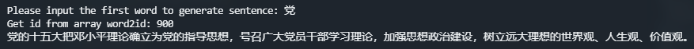

#### Usage

- 实验环境方面只需要安装Pytorch即可

- 预训练模型rnnlm_epoch_50.pth比较大，若邮件下载较慢，可以在以下百度网盘地址中下载：

  ```
  链接：https://pan.baidu.com/s/1S_dbG9oONpURr0JqhAzEzA 
  提取码：zm8w 
  复制这段内容后打开百度网盘手机App，操作更方便哦--来自百度网盘超级会员V4的分享
  ```

- 请将预训练模型放在当前文件夹的checkpoint中

- 若要运行测试代码，键入以下命令就可以根据预训练模型来生成句子：

  ```
  python test.py --model_path "checkpoint/rnnlm_epoch_50.pth"
  ```

- 若GPU显存不足无法载入模型，可以将test.py代码的第111行注释掉，并将下一行指定cpu的一行反注释

- 若运行正常会得到如下结果：

  

  