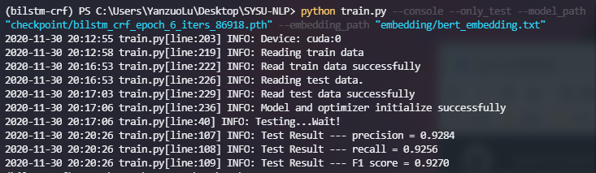

# SYSU-NLP

中山大学数据科学与计算机学院2020秋自然语言处理课程-权小军教授

#### Usage

- 代码对环境的要求仅有安装pytorch，有无gpu均可自动识别并运行，pytorch安装可以参考官网https://pytorch.org/get-started/locally/

- train.py代码使用了argparse库可以解析命令行参数，具体参数可以键入以下命令进行查看

  ```
  python train.py --help
  ```

- checkpoint/文件夹中提供了预训练的BiLSTM+CRF分词模型，embedding/文件夹中则是预训练的词向量，若要复现报告中的F1准确率，可键入以下命令运行测试程序对预训练的分词模型进行测试，未提及的参数都带有默认值default不需设置，根据机器算力不同，程序运行时间可能比较长请耐心等待

  ```
  python train.py --console --only_test --model_path "checkpoint/bilstm_crf_epoch_6_iters_86918.pth" --embedding_path "embedding/bert_embedding.txt"
  ```

- 正常的运行结果应如下图所示：

  

